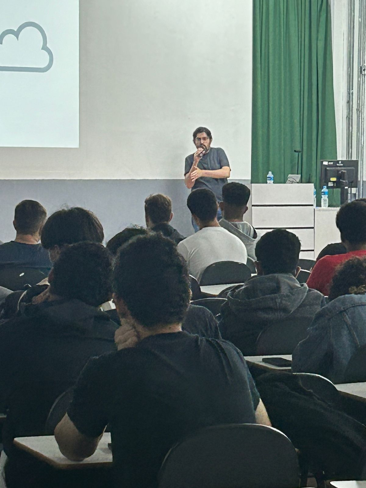
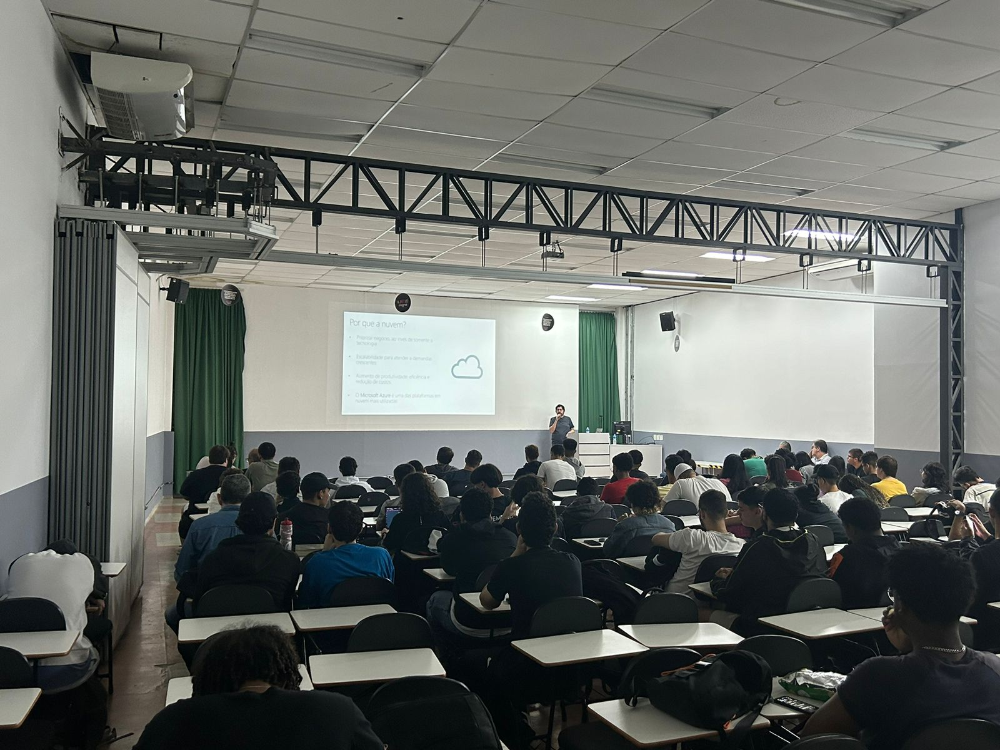
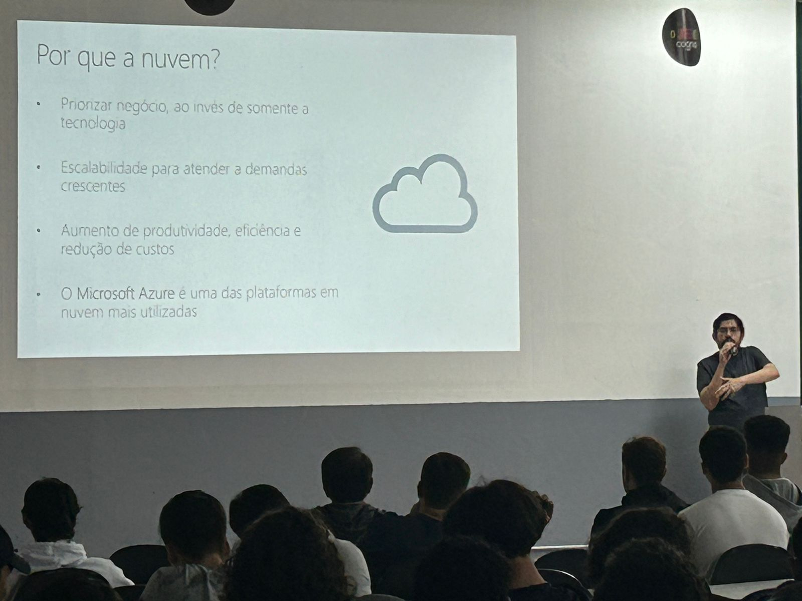
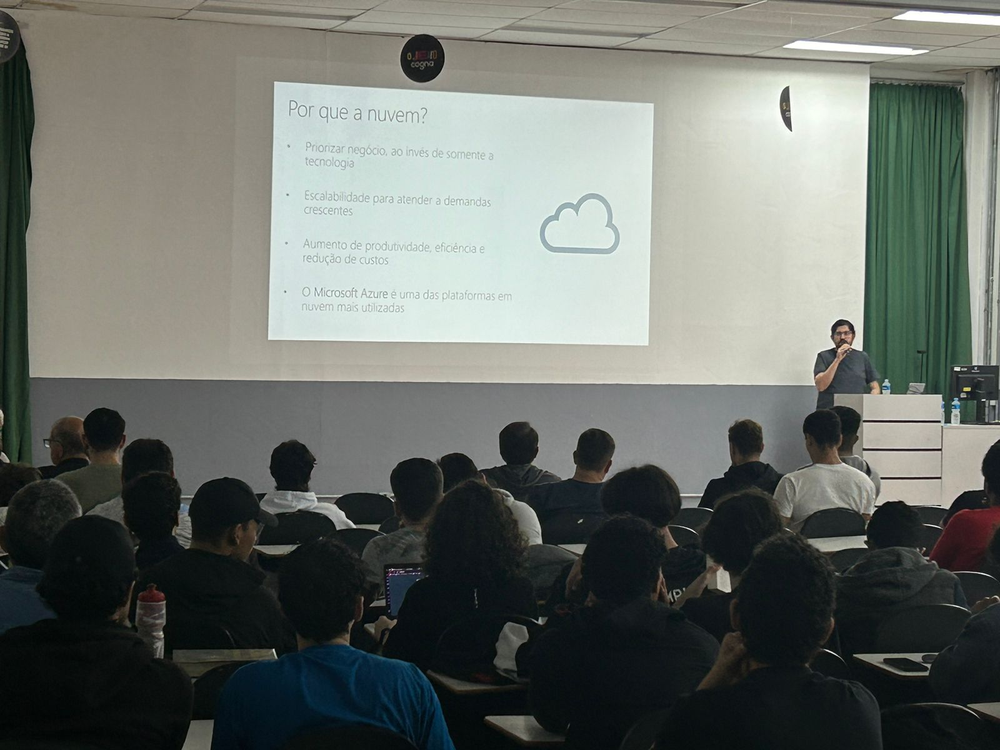
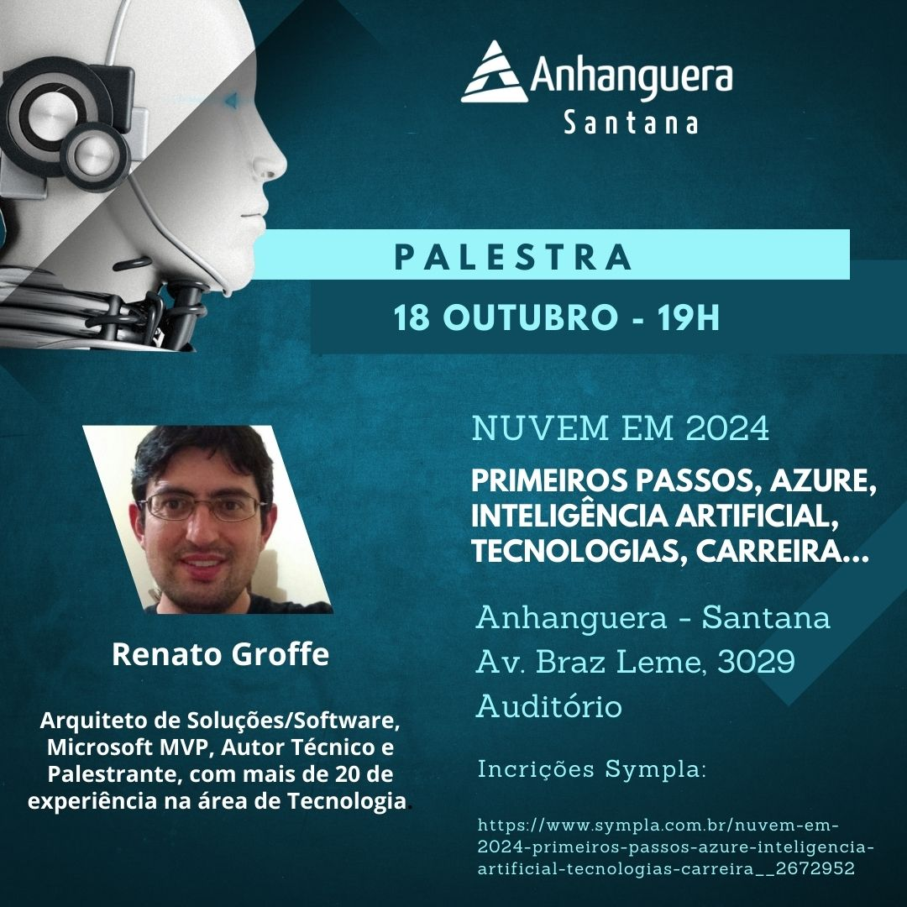
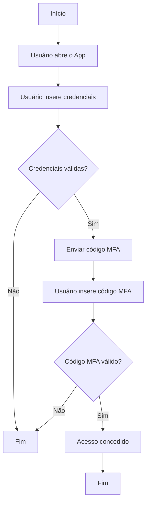

# Nuvem-IA-Mercado_Anhanguera-2024-10

Conteúdos da apresentação "Nuvem/Cloud Computing em 2024 - Primeiros passos, Azure, Containers, Inteligência Artificial, tecnologias, carreira..." para alunos da Faculdade Anhanguera - Campus Marte-Santana. Talk realizada em 18/10/2024 (sexta) na cidade de São Paulo-SP.

Palestrante: Renato Groffe - **Microsoft MVP, Docker Captain, MTAC**

Agradecimentos ao [**Prof. Cleyton Ferreira Franco**](https://www.linkedin.com/in/cleyton-ferreira-franco/) e à [**Profa. Luciana Maximiano**](https://www.linkedin.com/in/luciana-maximiano/) pelo convite e por todo o apoio para que esta palestra acontecesse.

Tecnologias e tópicos abordados: **Cloud Computing, DevOps, Containers, Open Source, Cloud Native, Docker, Kubernetes, Microsoft Azure, GitHub Copilot, OpenAI, Linux, Azure DevOps, GitHub**

Número de participantes: **60 pessoas**

Local: **Avenida Braz Leme, 3029 - Santana, São Paulo - SP - CEP 02022-011**

---











---

## Exemplo de uso do Copilot

O que perguntei:

```
Gere para mim um fluxograma em Mermaid explicando como fica o processo de autenticação multifator (MFA) em um App mobile.
```

Fluxograma:


