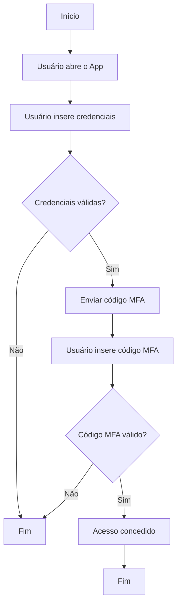

 Conteúdos da apresentação "Nuvem/Cloud Computing em 2024 - Primeiros passos, Azure, Inteligência Artificial, tecnologias, carreira..." realizada em 18/10/2024.

---

# Exemplo de uso do Copilot

O que perguntei:

```
Gere para mim um fluxograma em Mermaid explicando como fica o processo de autenticação multifator (MFA) em um App mobile.
```

Fluxograma:

